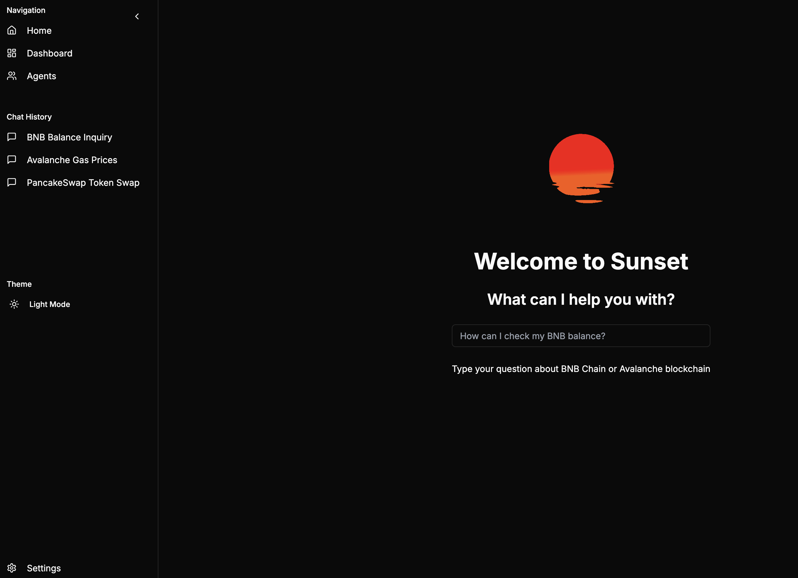

# Sunset - Natural Language Processing Wallet

Sunset is an innovative blockchain wallet interface that uses natural language processing to make blockchain interactions more intuitive and accessible. Users can interact with multiple blockchain networks through simple conversational commands.



## 🌅 Features

- **Natural Language Interface**: Interact with blockchain functions using plain English
- **Multi-Chain Support**:
  - BNB Chain
  - Avalanche
  - Solana
- **Intelligent Chain Selection**: Automatically determines the most appropriate blockchain for your request
- **Key Operations**:
  - Token transfers
  - Token swaps
  - Staking
  - Balance checks
  - Network information

## 🚀 Getting Started

### Prerequisites

- Node.js (v18 or higher)
- Python 3.8+
- OpenAI API key
- Privy App ID

### Installation

1. Clone the repository:

```bash
git clone [your-repository-url]
```

2. Install frontend dependencies:

```bash
cd appwallet
npm install
```

3. Install backend dependencies:

```bash
cd backend
pip install -r requirements.txt
```

4. Set up environment variables:

```bash
# Frontend (.env)
NEXT_PUBLIC_PRIVY_APP_ID=your_privy_app_id

# Backend (.env)
OPENAI_API_KEY=your_openai_api_key
```

### Running the Application

1. Start the frontend:

```bash
cd appwallet
npm run dev
```

2. Start the backend:

```bash
cd backend
python Agents.py
```

The application will be available at `http://localhost:3000`

## 🔧 Technology Stack

### Frontend

- Next.js 13+
- TypeScript
- Tailwind CSS
- Privy Authentication
- Shadcn/ui Components

### Backend

- Flask
- OpenAI GPT-4
- Python

## 🤝 Contributing

Contributions are welcome! Please feel free to submit a Pull Request.

## 📝 License

[Your chosen license]

## 🔗 Links

- [Documentation]()
- [Demo]()
- [Support]()

## ✨ Acknowledgments

- OpenAI for GPT-4 API
- Privy for authentication
- Shadcn for UI components
